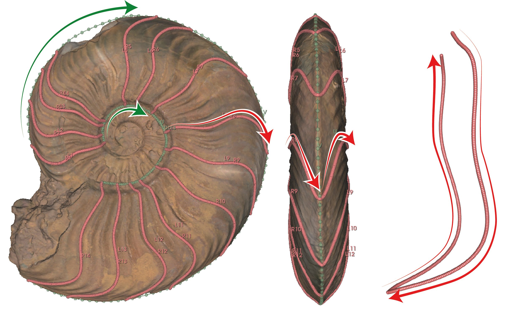

```{r set_up, include=FALSE}
# Setup environment
knitr::opts_chunk$set(
  collapse = TRUE,
  comment = "#>",
  fig.align = "center",
  warning = FALSE,
  message = FALSE
)

library(kableExtra)
library(rgl)
```

# Introduction

**`AmmoniTools`** provides a comprehensive set of tools for geometric morphometric analysis of ammonite shell morphology and ontogeny.

Ammonite shells grow by successive accretion of apertures (peristomes): each new aperture is formed as a modification of the previous one. As a result, shell shape variation is best described as a sequence of developmentally linked aperture shapes.

Building on this principle, `AmmoniTools` is designed to capture, process and analyse successive 3D peristome shapes through ontogeny, providing direct access to growth trajectories and their variation within and among individuals.

The package includes functions for 3D landmark processing, missing data reconstruction and downstream morphometric analyses (@fig-workflow). It is designed to integrate with existing morphometrics workflows such as those implemented in [geomorph](https://cran.r-project.org/web/packages/geomorph/index.html) [@baken2021; @adams2025] and [Morpho](https://cran.r-project.org/web/packages/Morpho/index.html) [@schlager2017], while introducing tools specifically tailored to incremental and coiled shell systems.

)](images/method_overview.jpg){#fig-workflow width="812"}

::: {.callout-important title="Before you start: important assumptions and constraints"}
The workflow implemented in `AmmoniTools` relies on several biological and methodological assumptions. Please read this section carefully before landmarking your data.

-   **Ribs as growth lines proxies:** ribs are assumed to form parallel to growth lines (@fig-ribs) and therefore are used as proxy to aperture shape when growth lines are not preserved.

-   **Incremental growth:** successive apertures from the same specimen are developmentally linked and expected to be more similar to each other than to apertures from other individuals.

-   **Bilateral symmetry:** ammonite shells are assumed to be bilaterally symmetric and therefore this symmetry can be used to reconstruct a missing side of the aperture.

-   **Near-complete apertures requires:** at least 80% of the aperture outline must be preserved for reliable missing data reconstruction (see [Test_biases vignette](Test_biases.html)).

-   **Flanks must be preserved:** missing data are allowed in ventral and/or dorsal areas, but not on the flanks.

-   **Ontogenetic order matters:** apertures must be consistently ordered from juvenile to adult stages.
:::

![A. Anatomical structures of a planispiral ammonite shell. The ventral area is coloured in red and the dorsal area in blue. I2 corresponds to the rib median inflexion point following [@gabilly1976] and [@bardin2017] nomenclature. B. Specimen of *Pleydellia lugdunensis* (FSL169668) showing growth lines ‘parallel’ to ribs.](images/assumptions.jpg){#fig-ribs width="812"}

This vignette demonstrates the **preprocessing steps** of the workflow, i.e. how to obtain data suitable for geometric morphometric analyses:

-   Landmarking successive apertures in [3D Slicer](https://www.slicer.org/)

-   Loading and organising landmark data in [R](https://www.r-project.org/)

-   Reconstruction of incomplete apertures

# Landmarking in *3D Slicer*

## Aperture shape capture

`AmmoniTools` is built to process landmark data exported from [3D Slicer Markups](https://slicer.readthedocs.io/en/latest/user_guide/modules/markups.html). First, ammonite 3D models (.ply or .obj files) are imported into [3D Slicer](https://www.slicer.org/). Then, successive aperture shapes are identified using growth lines and/or ribs.

Each aperture must be landmarked **separately on the left and right sides**, reflecting the bilateral organisation of the peristome. These curves are complemented by ventral and umbilical reference curves, which provide spatial context along the shell.

::: callout-note
We recommend landmarking using *Curve* option in Markups with *Spline* as curve type option. More information [here](https://slicer.readthedocs.io/en/latest/user_guide/modules/markups.html).
:::

::: callout-caution
The right side here corresponds to the right side when facing the ammonite in life position — meaning it is actually the left side of the organism. The same logic applies for the left side.
:::

### Landmarking order

Landmarking must follow a strict and consistent order (@fig-landmarkings), which is essential for downstream analyses and missing data reconstruction:

-   **Right side (*R*)**: from the umbilical suture to the ventral edge
-   **Left side (*L*)**: from the ventral edge to the umbilical suture

Ventral (*V*) and umbilical (*U* and *Ubis*) curves must be landmarked from juvenile to adult stages.

{#fig-landmarkings width="703"}

### Resampling curve

All curves must be resampled to the **same number of landmarks**. This number can be change later in the process.

::: {.callout-note collapse="true" title="How many landmarks?"}
We recommend using a high number of landmarks to capture to finest details of the shapes. In @fig-landmarkings, for example, we resampled each curve into 200 landmarks.
:::

## Handling missing landmarks

Missing regions should be explicitly marked in [3D Slicer](https://www.slicer.org/) using one or two landmarks renamed "x" or "X". You can renamed landmarks by right clicking them and then *'rename control point...'* (see [here](https://slicer.readthedocs.io/en/latest/user_guide/modules/markups.html) for a more detailed tutorial). These points define the boundaries between missing and preserved portions of the aperture and allow `AmmoniTools` to identify which landmarks need to be reconstructed.

::: callout-caution
-   Use a **maximum of two "x"** landmarks per curve (i.e. up to four per aperture).

-   Only nearly complete apertures (**at least \~80% preserved**) should be landmarked.

-   **Missing regions** may occur in ventral and/or dorsal areas, but **not on the flanks**. If preservation is lacking in the flanks, please do not capture apertures.

-   If one side (left or right) is entirely missing, the preserved side can still be captured.
:::

::: callout-important
**Landmarks should still be placed continuously from the umbilical suture to the ventral edge, even if some of them are difficult to positionned and will later be treated as missing.**
:::

## Naming conventions for curves

For each specimen, every curve must have a unique name. Curves are named according to their type and sequence number:

-   R1, R2, ... → right-side curves (from juvenile to adult)

-   L1, L2, ... → left-side curves

-   U, Ubis → umbilical curves (one or two, depending on the specimen)

-   V → ventral curve

*Example*: R1 corresponds to the most juvenile right-side aperture, while L3 might represent a later ontogenetic stage on the left side.

## Data and metadata structure

The expected directory structure is:

```         
folder/
├── 182/
│   ├── L1.json
│   ├── R1.json
│   ├── L2.json
│   ├── R2.json
│   ├── ...
│   ├── V.json
│   ├── U.json
│   └── Ubis.json
├── 183/
│   ├── L1.json
│   ├── R1.json
│   ├── L2.json
│   ├── R2.json
│   ├── ...
│   ├── V.json
│   ├── U.json
│   └── Ubis.json
├── .../
└── specimen_tab.xlsx
```

Each subfolder corresponds to one specimen (e.g. 182, 183) and contains JSON files storing landmark coordinates for each curve.

The specimen metadata table (specimen_tab.xlsx) must contain at least one column named **"Specimen"**, listing specimen identifiers. These IDs must correspond to the subfolder names containing the landmark files. See `example_spec_tab` in the next section for an example.

# Data loading and organisation

## Load example data

Example data included with the package:

``` r
data("example_data", package = "AmmoniTools")
data("example_spec_tab", package = "AmmoniTools")
```

### `example_data`

This object contains two elements:

-   `landmarks`— nested list of 3D landmark coordinates:

```         
example_data$landmarks
  ├── 182
  │     ├── L1
  │     ├── R1
  │     ├── ...
  │     ├── U
  │     └── V
  ├── 183
  │     ├── L1
  │     ├── R1
  │     ├── ...
  │     ├── U
  │     └── V
```

Each curve is a matrix of dimension: `n_landmarks × 3  (X, Y, Z)`

-   `curve_info` — dataframe describing curve completeness and missing landmark indices. This table is used internally for missing-data handling and curve-level operations.

```{r}
library(AmmoniTools)
data("example_spec_tab", package = "AmmoniTools")
data("example_data", package = "AmmoniTools")

head(example_data$curve_info)
```

### `example_spec_tab`

`example_spec_tab` is a tibble containing specimen-level metadata (e.g. specimen ID, taxonomy):

```{r head_spec_tab, echo=FALSE}
knitr::kable(head(example_spec_tab), caption = "Specimen metadata example tab") %>%
  kable_styling(font_size = 9, bootstrap_options = c("condensed", "striped"))
```

## Extract landmarks from JSON files and optionally subset specimens

If you want to process your own data from [3D Slicer](https://www.slicer.org/) outputs, use:

``` r
folder <- "path/to/your/folder"
spec_tab <- readxl::read_excel("path/to/specimen_tab.xlsx")

raw_data <- extract_landmarks(folder,
                              spec_tab,
                              expected_ldm = list(R = 200, L = 200, U = 100, V = 100),
                              # Put your number of resampled landmark for each curve type
                              verbose = TRUE
)
```

This function reads JSON landmark files for each specimen, structures them by curve, and associates specimen metadata.

If you want to subset your dataset :

``` r
# Extract one particular species
raw_data <- extract_landmarks(
    "path/to/data",
    spec_tab = my_spec_tab,
    Species = "opalinum"   # filter applied on 'Species' column of spec_tab
    )

# Extract two particular genus and one particular species
raw_data <- extract_landmarks(
    "path/to/data",
    spec_tab = my_spec_tab,
    Species = "opalinum", Genus = c("Harpoceras", "Polypectus")  # combined filters
    )
```

::: callout-caution
Specimens not included is the specimen tab (`spec_tab`) will NOT be extract.
:::

## Visualize 3D apertures

You can visualize 3D apertures:

``` r
# Display one specimen
view_specimens(example_data$landmarks, specimen_id = "182")

# Browse all specimens
view_specimens(example_data$landmarks, all = TRUE)

# Choose interactively
view_specimens(example_data$landmarks)
```

This visualization can be performed at any step of the workflow.

```{r fig_raw_specimen184, message=FALSE, warning=FALSE, results='asis', echo=FALSE, fig.align='center'}
rgl::open3d(silent = TRUE)
view_specimens(example_data$landmarks, specimen_id = "184")
rgl::rglwidget(width = 600, height = 600)
```

::: {.callout-note collapse="true" title="What does the colors represent?"}
Red represents the right side of the aperture, blue the left side, and green the umbilical and ventral curves. This allows you to check whether a curve was misnamed. When the right and left sides are merged, the aperture becomes black.
:::

## Resample curves

You can increase or reduce the number landmarks along each curves using this function:

```{r resample, message=FALSE, warning=FALSE}
resampled_data <- resample_curves(example_data, n_landmarks = list(R = 25, L = 25, U = 25, V = 25))
```

You can choose the number of landmarks for each curve type using `n_landmarks` argument.

This function can be used, for instance, to standardize the sampling resolution between the different types of curves or to reduce file size for rapid analyses.

## Reorder and clean aperture curves

Geometric morphometric analysis require landmarks with the same order for each curve. If for some reason landmarks were not recorded in the same order, you can easily fix this with:

```{r reorder, message=FALSE, warning=FALSE}
reordered_data <- reorder_landmarks(resampled_data)
```

# Reconstruction of incomplete apertures

Now, it's time to take care of the missing landmarks. The idea is to use first the symmetry between left and right side and then, if there is still some missing landmarks, using complete apertures to complete the missing parts.

## Using bilateral symmetry

This function can reconstruct missing left/right (L or R) and umbilical (U or Ubis) landmarks by reflecting existing landmarks across a local symmetry plane. The plane is estimated using either exponential or linear weighting. This function also remove left-right asymmetry by averaging both sides.

```{r symmetrize, message=FALSE, warning=FALSE}
data_sym <- symmetrize_sides(reordered_data,
                             weighting = "exp" # example with exponential weighting
                             )
```

``` r
view_specimens(data_sym$landmarks, specimen_id = "184")
```

```{r fig_sym_specimen184, message=FALSE, warning=FALSE, results='asis', echo=FALSE, fig.align='center'}
rgl::open3d(silent = TRUE)
view_specimens(data_sym$landmarks, specimen_id = "184")
rgl::rglwidget(width = 600, height = 600)
```

## Using other complete apertures

This step completes the remaining missing landmarks using morphologically similar ‘donor’ apertures. Donors are selected based on morphological proximity, and optionally constrained by a user-defined hierarchy (e.g., Specimen → Species → Genus). For example, if you want to reconstruct a aperture of a *Harpoceras subplanatum*, you can add Specimen → Species → Genus as hierachy, then the donors would preferentially be from the same specimen and then from the same species, and then from the same genus. In any case, the impact on each donors in the missing landmark reconstruction depend on the morphological proximity with the incomplete aperture (calculated on the non-missing landmarks, obviously).

```{r reconstruct, message=FALSE, warning=FALSE}
merged_data <- merge_sides(data_sym) # merged R and L sides as one object

reconstructed_data <- reconstruct_missingldm(
  merged_data,
  metadata = example_spec_tab,
  hierarchy = list("Specimen", "Species", "Genus"),
  weighting_function = "gaussian",
  max_donors = 10,
  verbose = TRUE
)
```

``` r
view_specimens(reconstructed_data$landmarks, specimen_id = "184")
```

```{r fig_reconstruct_specimen184, message=FALSE, warning=FALSE, results='asis', echo=FALSE, fig.align='center'}
rgl::open3d(silent = TRUE)
view_specimens(reconstructed_data$landmarks, specimen_id = "184")
rgl::rglwidget(width = 600, height = 600)
```

::: {.callout-important title="Summary"}
***`AmmoniTools`*** enables you to:

-   **Import 3D landmark data from** [3D Slicer](https://www.slicer.org/)**,**

-   **Reorder, interpolate, and reconstruct ammonite apertures,**

-   **Prepare consistent datasets for morphometric and ontogenetic analyses.**

Application examples are available in [Applications_examples vignette](Applications_examples.html).

See the [Test_biases vignette](Test_biases.html) vignette for a detailed evaluation of potential methodological biases.
:::
